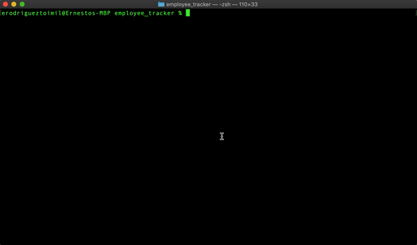

# Employee Tracker

Author: Ernesto Rodriguez

## Description

### Unit 12 MySQL Homework: Employee Tracker
Developers are often tasked with creating interfaces that make it easy for non-developers to view and interact with information stored in databases. Often these interfaces are known as **C**ontent **M**anagement **S**ystems. In this homework assignment, your challenge is to architect and build a solution for managing a company's employees using node, inquirer, and MySQL.

## Usage

- git clone https://github.com/erodrigueztoimil/employee_tracker.git
- cd employee_tracker
- yarn
- node server.js

## Interface

